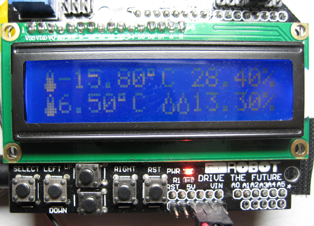

# DHT22x2_LCD_Display
Arduino UNO program that monitors temperature and humidity readings from two DHT22 (AM2302) sensors

### Compiling Code

This project was developed using the "ino" command line toolkit for the Arduino,
 further infomation available at http://inotool.org.

